# Test Suite Documentation

This document describes the test suite and includes illustrations for tests that benefit from visual representation.

## 3-Venn Diagram; test_venn3.c

A simple 3-Venn diagram is one where each pair of curves intersects exactly once, and no three curves intersect at a single point. There is only one such diagram up to homeomorphism:

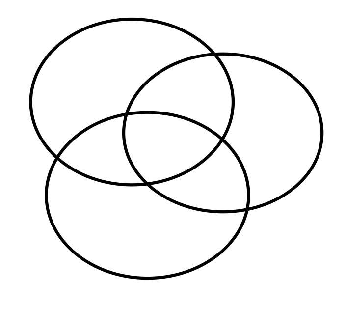

Other 3-Venn diagrams exist, but they violate the simplicity condition by having multiple lines through a single point. For example, from the online survey [Ruskey and Weston], notice that the left one of this pair can be drawn with convex curves (e.g. triangles), and the right one cannot (e.g. the outer face has only two sides;
breaking monotonicity (see [maths](./MATH.md)) preventing convex shapes).

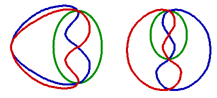

This means that compiling the code with `NCOLORS` as 3 allows
us to verify the data structures fairly easily since they are small, and less complicated than with 6 colors.

There are six ways to label the simple 3-Venn diagram with the six permutations of _A_, _B_, and _C_. However, we keep the first fixed arbitrarily leaving us two labellings:

### ABC

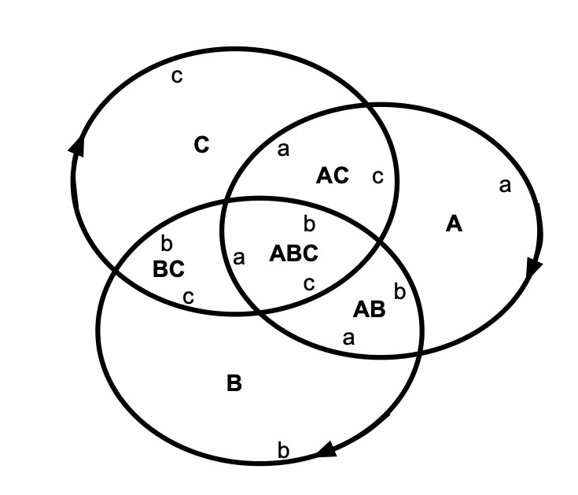

### ACB

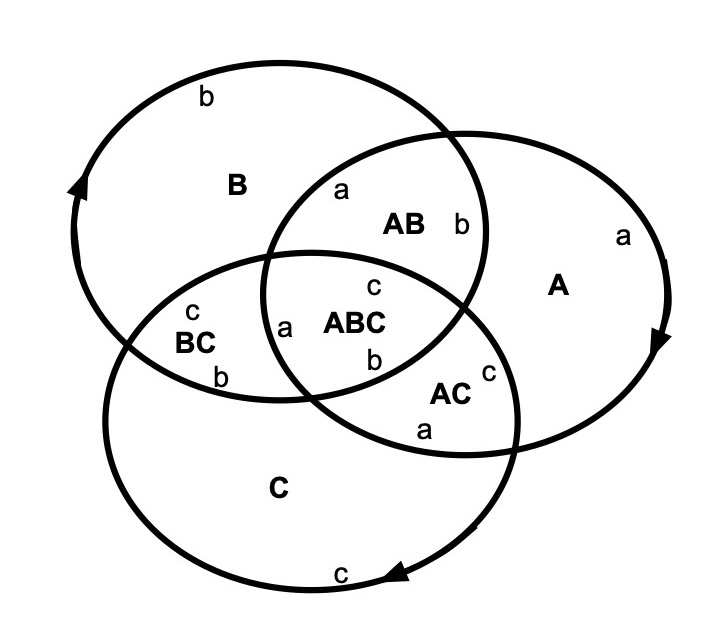

### Face Adjacency Tests

Both of these labelings (ABC and ACB) have the same adjacency relationships between the faces, which are set up during the [initialization](https://github.com/jeremycarroll/venntriangles/blob/89880833bde79e640d6c25026d9b59708afc3177/test/test_venn3.c#L28) phase. In the tests, the initialization does not
get reversed in the `tearDown` function, instead, the initialization is idempotent. The key difference between these two
labelings is the orientation. We orient all curves in a clockwise fashion, so that the central face has cycle _abc_ in the first, and _acb_ in the second. This clockwise orientation is an artifact of our approach to the search, and not fundamental to the
Venn diagram, which does not have the arrows on the curves (or the labels). Conventionally, we read the edges of the outer face counter-clockwise not clockwise. The first picture has the inner face with facial cycle _abc_ and the outer face with facial cycle _acb_. 

We test both orientations of the inner face.

There are several tests such as [testOuterFace](https://github.com/jeremycarroll/venntriangles/blob/89880833bde79e640d6c25026d9b59708afc3177/test/test_venn3.c#L60) and [testAbFace](https://github.com/jeremycarroll/venntriangles/blob/89880833bde79e640d6c25026d9b59708afc3177/test/test_venn3.c#L78) verifying the basic relationships between the faces, which are the same in both of those diagrams.

### Edge & Vertex Tests

There are four tests to verify the vertices for the 3-Venn case. While we know the color of the 8 faces, we don't know
the nature of the vertices. As becomes more important in the 6-Venn case, during initialization, we memoize the relationships between all the _possible_ vertices and the _possible_ edges 
and the (2N) faces before we start. A possible vertex is 
[characterized](https://github.com/jeremycarroll/venntriangles/blob/89880833bde79e640d6c25026d9b59708afc3177/vertex.c#L135) by the colors of the outermost face adjacent to the vertex 
and the two colors of the edges passing through the vertex (neither of which is a face color). For N=3, this gives us 2^(3-2) × 3 × (3-1) = 2 × 3 × 2 = 12 possible vertices. 
The two edges passing through the vertex are [distinguishable](https://github.com/jeremycarroll/venntriangles/blob/89880833bde79e640d6c25026d9b59708afc3177/vertex.h#L37-L39). 
One edge, the primary edge, passes from inside the curve of the other edge, the secondary edge, to outside. The secondary edge, conversely, passes from 
outside the curve of the primary edge, to inside. Thus we have 2N - 2 × N x (N-1) different possibly vertices. For 3-Venn diagrams, that is 12 possible vertices, 
i.e. those found in the diagrams _ABC_ and _ACB_ above. In each of the two actual solutions, we use 6 of them because each vertex must be used exactly once, and a 3-Venn diagram has exactly 6 vertices 
(two for each pair of curves intersecting).

With 6 colors, the number of possible vertices is a fairly modest 480, compared with the 14,446 vertices found in the actual 233 solutions. Each possible vertex appears in multiple solutions. In any of the actual solutions we only use 62 of the 480 possible vertices.

The format, and the body, of the four face and edge tests are the same. Each tests selects one of the faces (the 
[A face](https://github.com/jeremycarroll/venntriangles/blob/89880833bde79e640d6c25026d9b59708afc3177/test/test_venn3.c#L129), 
the [AB face](https://github.com/jeremycarroll/venntriangles/blob/89880833bde79e640d6c25026d9b59708afc3177/test/test_venn3.c#L136) 
and the [ABC face](https://github.com/jeremycarroll/venntriangles/blob/89880833bde79e640d6c25026d9b59708afc3177/test/test_venn3.c#L143)
and the
[outer face](https://github.com/jeremycarroll/venntriangles/blob/89880833bde79e640d6c25026d9b59708afc3177/test/test_venn3.c#L122))
and finds the A edge on that face and the possible vertex 
with the B edge, where the A edge and B edge meet. The direction 
of the edge is clockwise (counterclockwise for the outer face),
and so one or other of the _ABC_ or _ACB_ pictures applies: the one in which the A edge next to the face is heading towards the B edge of that face, rather than away from it. The A edge is either clockwise around that face or not. At the A,B vertex where the edges meet, the A edge is either primary or secondary (as above).

The first three cases are illustrated:

The _ABC_ picture is the one with the a,b vertex on the A-face. The _ACB_ picture has a b,a vertex on the A-face.

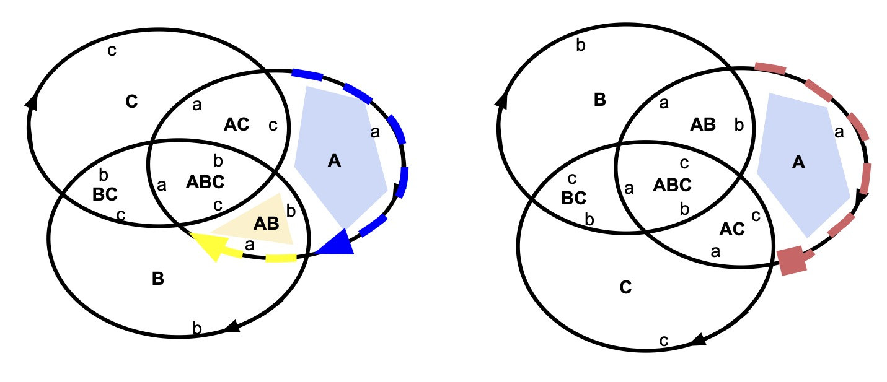

The _ACB_ picture is the one with the a,b, vertex on the AB-face.

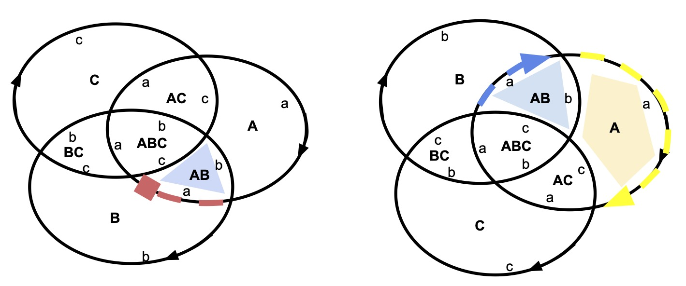

The _ABC_ picture is the one with the a,b, vertex on the ABC-face.

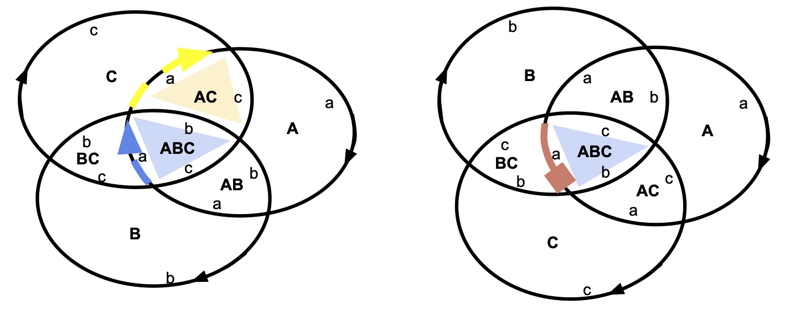

We put that together in the following table, that motivates
the details of the test cases.

Face | A is Clockwise around face | A is primary at vertex | next Face after vertex
-- | -- | -- | --
A | true | false | AB
AB | true | true | A
ABC | true | true | AC
outer | false | true | B

Notice the counterclockwise orientation for the outer face.

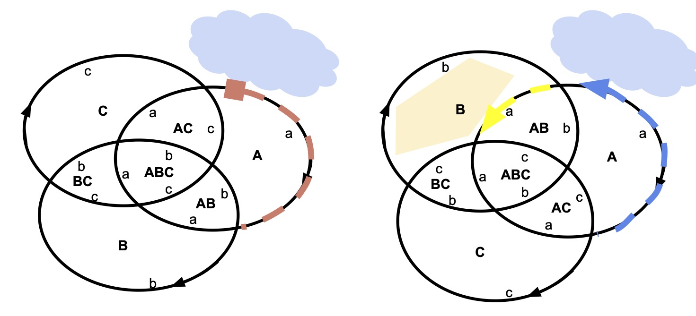

### Checking backtracking and search

While searching for 3-Venn diagrams is trivial, we have tests to check the function.
Selecting the facial cycle in any face reduces the search space from 2 to 1 for every face,and each of the other 7 faces is set.
A full search finds both solutions _ABC_ and _ACB_, and has 14 forced settings of facial cycles.

## test_venn4.c

There is also only one simple, convex 4-Venn diagram:

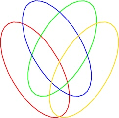

There is one other simple 4-Venn diagram, but this can't be drawn with convex curves: the outer faces has only three sides.

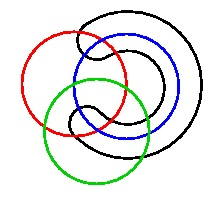

Being non-convex, this is excluded from our search. The exclusion is implemented in [applyMonotonicity](https://github.com/jeremycarroll/venntriangles/blob/89880833bde79e640d6c25026d9b59708afc3177/face.c#L102),
the tests below, simply by counting the solutions, verify that that function is working correctly to exclude this case.

### Search Tests

The tests are less interesting than for the 3-Venn case. With no constraints on the faces, there are 
[24 different solutions](https://github.com/jeremycarroll/venntriangles/blob/89880833bde79e640d6c25026d9b59708afc3177/test/test_venn4.c#L38),
corresponding to the 4! different orderings of _abcd_.

If we set the facial cycle of the inner face to _abcd_, then that eliminates 3! options of variability, 
leaving [4 different labellings](https://github.com/jeremycarroll/venntriangles/blob/89880833bde79e640d6c25026d9b59708afc3177/test/test_venn4.c#L47).

From the [maths](./MATH.md) we know that the sum of the degrees of the 3-faces will be 14, and that gives either 
`(4, 4, 3, 3)` or `(4, 3, 4, 3)` as the cycle of face degrees. The former has the faces BCD and ACD with four sides, and
the faces ABD and ABC with 3 sides. This eliminate all variability and 
finds the [single solution](https://github.com/jeremycarroll/venntriangles/blob/89880833bde79e640d6c25026d9b59708afc3177/test/test_venn4.c#L65). 
The latter has [no solutions](https://github.com/jeremycarroll/venntriangles/blob/89880833bde79e640d6c25026d9b59708afc3177/test/test_venn4.c#L56).

## test_venn5.c

With the 5-Venn diagrams, we test the functionality that identifies isomorphism classes of the Venn diagrams.

The diagram of interest is this one:

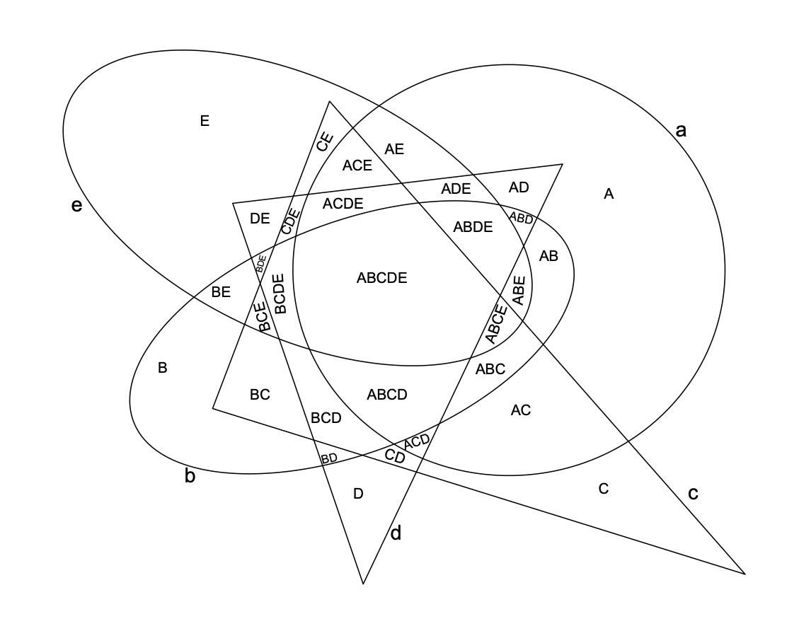

This can be relabeled to flip the inner face with the outer face:

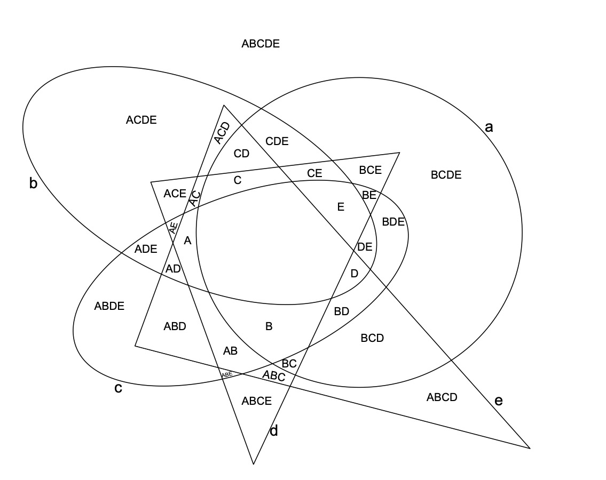

And then projected onto a sphere and then back down onto a plane at the other pole, inverting the picture:

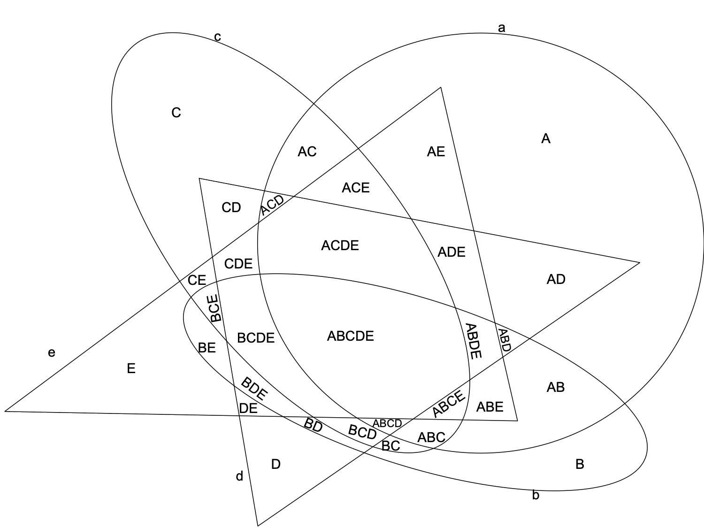

We also can flip the circle in the first diagram to give:

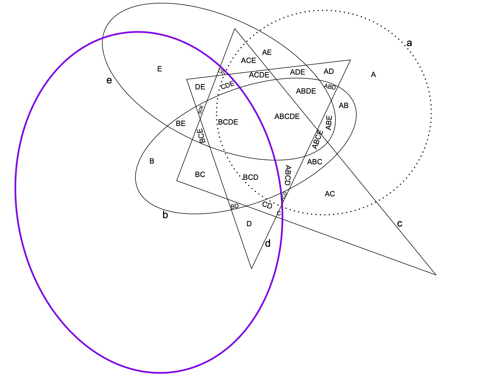

and relabelling it to give:

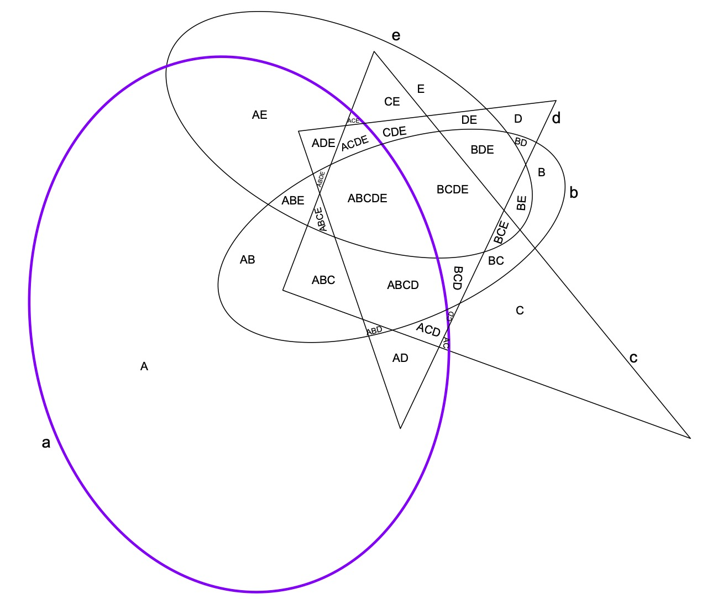

Either inverting this picture, or flipping the circle in the inverted picture, and relabelling we get:

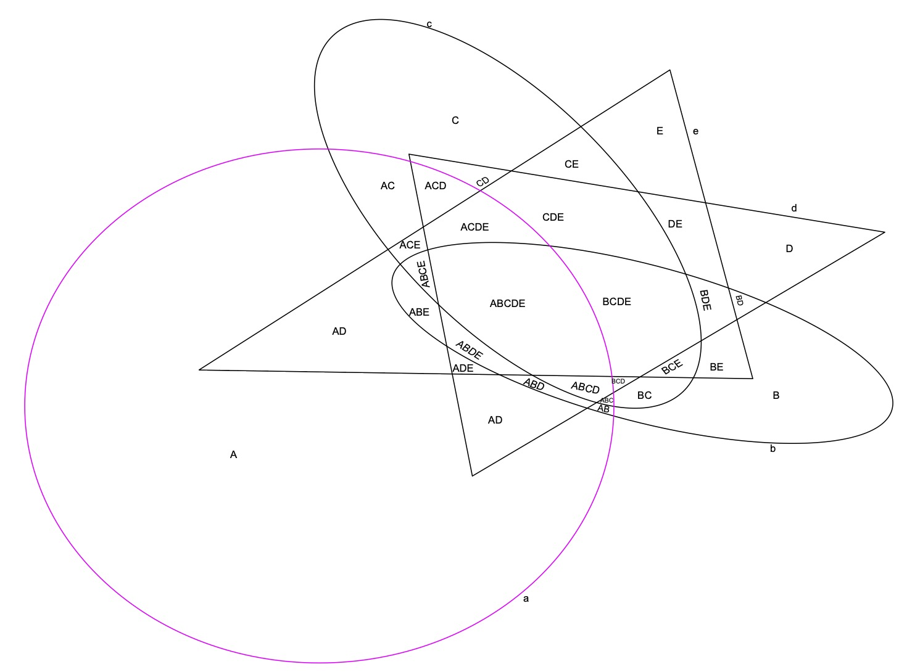

These four different diagrams are the same when viewed on a sphere rather than the Euclidean plane.
This is described as them being in the same isomorphism class.

The code identifies the isomorphism class using [s6MaxSignature](https://github.com/jeremycarroll/venntriangles/blob/89880833bde79e640d6c25026d9b59708afc3177/s6.c#L152-L169).
A key goal of this test file is to test that function.

We can choose one of the 32 = 2N, and one of the 120 = 5! labellings of the lines, and compute a signature being simply the sequence
of the 2N facial cycles, in some ordering of the faces.
Given any total ordering of the facial cycles, we can then take the maximum signature, over these 32 × 120 possible choices.
For simplicity in the code, we choose to write down the faces in numeric order by bits, i.e. `( ∅, A, B, AB, C, AC, BC, ABC, D, ... )`
we also order the facial cycles somewhat arbitrarily but ensuring all the 5-cycles are after the 4-cycles, which are after the 3-cycles,
and also ensuring `(a,b,c,d,e)` is last (maximal). Given these arbitrary choices, the maximum signature in this case is one in which the
outer face, the A face and the B face, all have face degree being 5, and the outer facial cycle is `(a,b,c,d,e)`. The actual maximal value
corresponds to the first diagram, labelled differently:

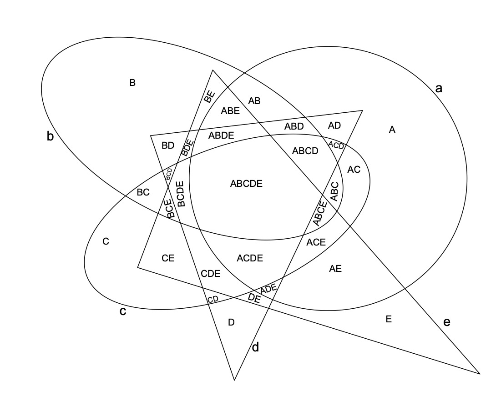

this labelling is listed in the [test file](https://github.com/jeremycarroll/venntriangles/blob/89880833bde79e640d6c25026d9b59708afc3177/test/test_venn5.c#L65-L98).

These are four different 5-Venn diagrams from the same isomorphism class.

This is verified through the action of [testSearchAbcde](https://github.com/jeremycarroll/venntriangles/blob/89880833bde79e640d6c25026d9b59708afc3177/test/test_venn5.c#L144)
which does a complete search with duplicates for each member of the dihedral group D₅, giving 
[40 matches](https://github.com/jeremycarroll/venntriangles/blob/89880833bde79e640d6c25026d9b59708afc3177/test/test_venn5.c#L145-L150)
with the appropriate signature, 10 from each solution (corresponding to the 10 members of D₅: 5 rotations, each of which can be reflected).

In [testInvert](https://github.com/jeremycarroll/venntriangles/blob/89880833bde79e640d6c25026d9b59708afc3177/test/test_venn5.c#L218-L224)
we note that setting up the face degrees for the 4-faces as `(5,4,4,3,4)` (summing to 2 × 5 + 10), and restricting
the BC face to have three sides, restricts us to this case, and we can verify the signature as above.

## test_venn6.c

These tests are less interesting, simply exercising the Venn code to search the space, and find the known number of solutions for
the different test scenarios. [testFullSearch](https://github.com/jeremycarroll/venntriangles/blob/89880833bde79e640d6c25026d9b59708afc3177/test/test_venn6.c#L79)
does the complete search of the space of 6-Venn triangles in just a few seconds. It excludes the corner assignment which adds to the
search space, and slows things down a bit, but is a lot less challenging mathematically than the Venn search.

## test_known_solution.c

In the test driven development approach used, this was one of the earlier test files. We are testing the deterministic parts of choosing facial cycles, to make sure that
it is possible to use the individual facial cycles from the Carroll 2000 solution, to find that complete solution.

We relabel the published solution:

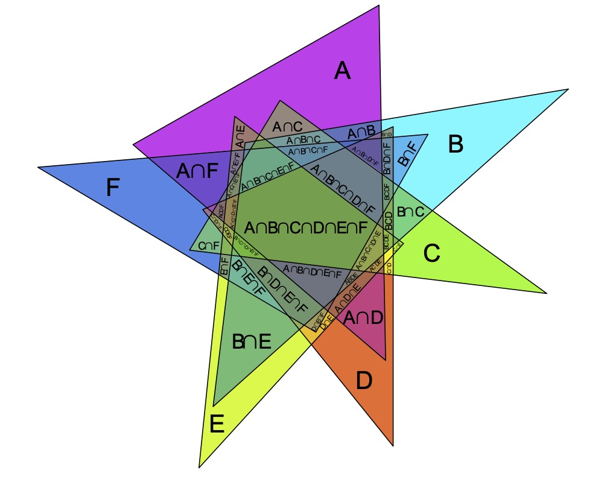

to have the inner face have cycle `(a b c d e f)`:

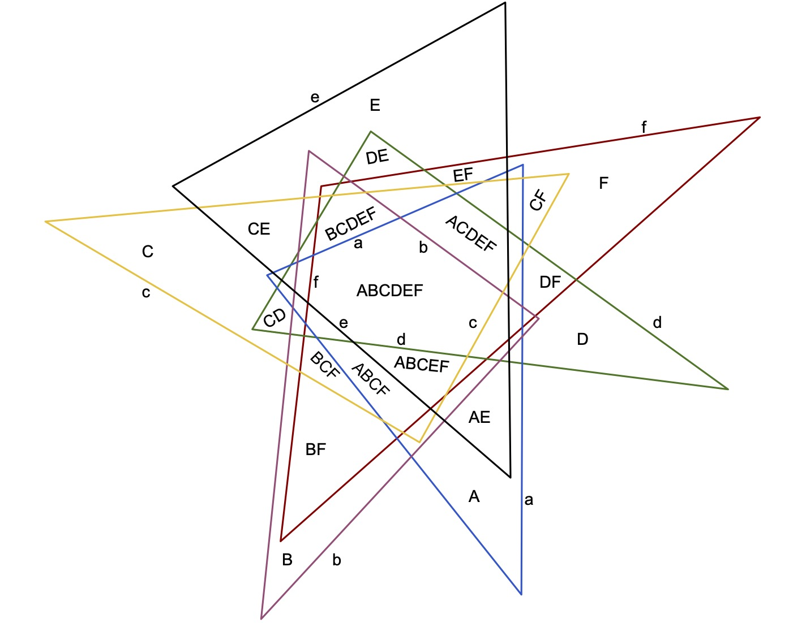

We record each of the facial cycles in the [test data](https://github.com/jeremycarroll/venntriangles/blob/89880833bde79e640d6c25026d9b59708afc3177/test/test_known_solution.c#L29-L296). Each test 
adds some or all of these facial cycles to the solution recorded in the `Faces` variable, and computes the consequences.

## test_graphml.c

This test suite verifies the GraphML output format of a few specific runs.

One is [the XML](./555444-64-27-005.xml) corresponding to the known solution above, 
[tested here](https://github.com/jeremycarroll/venntriangles/blob/89880833bde79e640d6c25026d9b59708afc3177/test/test_graphml.c#L608),
against [the corner to face mapping](https://github.com/jeremycarroll/venntriangles/blob/89880833bde79e640d6c25026d9b59708afc3177/test/test_graphml.c#L414-L426) 
read from the picture.

The [basic XML check](https://github.com/jeremycarroll/venntriangles/blob/89880833bde79e640d6c25026d9b59708afc3177/test/test_graphml.c#L606) uses a solution found in [this XML file](./645534-01-001.xml).

A more interesting solution is [this one](654444-26-0a-000.xml), or [this variation](654444-26-6c-037.xml) where there are 
[three pairs of corners with no intervening vertices](https://github.com/jeremycarroll/venntriangles/blob/89880833bde79e640d6c25026d9b59708afc3177/test/test_graphml.c#L388-L396).

## References

Ruskey, Frank, and Mark Weston. "[Venn diagrams.](https://www.combinatorics.org/files/Surveys/ds5/ds5v3-2005/VennEJC.html)" The electronic journal of combinatorics (2005): DS5-Jun.