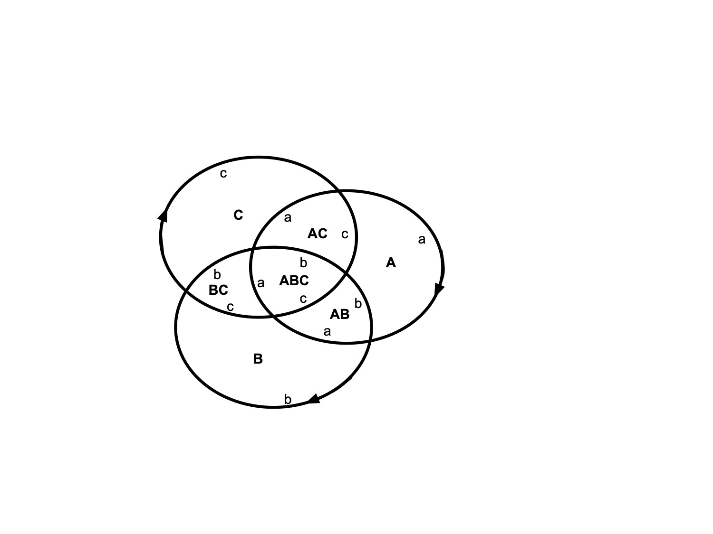

# Test Suite Documentation

This document describes the test suite and includes illustrations for tests that benefit from visual representation.

## test_venn3.c

This test suite verifies the basic structure of a 3-Venn diagram. Several tests would benefit from illustrations:

### Edge Tests

The following tests verify edge relationships between faces and need illustrations:

1. `testOuterAEdge` - Tests the edge between the outer face and face A
2. `testAFaceAEdge` - Tests the edge between face A and its adjacent faces
3. `testAbFaceAEdge` - Tests the edge between face AB and its adjacent faces
4. `testAbcFaceAEdge` - Tests the edge between face ABC and its adjacent faces

TODO: Add illustrations for these tests showing:
- Face relationships
- Edge directions
- Vertex configurations
- Color assignments

## test_venn5.c

This test suite includes tests for the 5-Venn diagram, with existing illustrations for the inversion tests:

### Inversion Tests

The test `testInvert` verifies the behavior of the diagram under label inversion. The following illustrations are available in `images/test_venn5.testInvert/`:

1. `original.pdf` - The original diagram
2. `labels-inverted.pdf` - The diagram with inverted labels
3. `fully-inverted.pdf` - The fully inverted diagram

These illustrations demonstrate how the diagram structure changes under different types of inversions.

## test_known_solution.c

This test suite verifies the Carroll 2000 solution and its properties. It would benefit from illustrations showing:

1. The face relationships
2. The cycles around faces
3. The dihedral group transformations (testDE1, testDE2)

TODO: Add illustrations for these tests.

## test_graphml.c

This test suite verifies the GraphML output format. Future illustrations will be generated from the GraphML files showing:

1. The node/vertex structure
2. The edge relationships
3. The corner assignments
4. The color/label assignments

Note: These illustrations will be generated in a future project using the GraphML output files.

## Future Work

1. Generate illustrations for test_venn3.c edge tests
2. Generate illustrations for test_known_solution.c
3. Create a tool to generate pseudoline diagrams from GraphML files
4. Generate illustrations for test_graphml.c using the GraphML output 